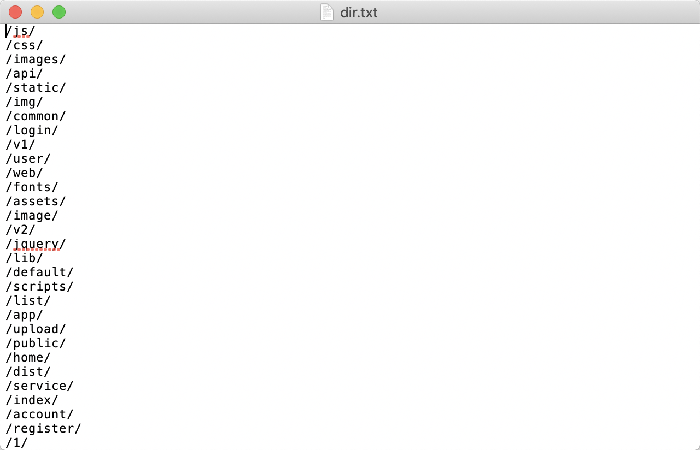

## Introduction

BurpSuite data collection plugin can collect parameter names, directories, paths, and file names in the request history.
Save this data in MySQL database. Sort by the number of occurrences during export to generate a sorted dictionary.
The most frequent occurrences come first.

## Features

- Data is automatically exported to the database every ten minutes, and manual export is supported.
- Export dictionary from database to txt file, csv file. The txt file is used for the dictionary, and the csv file is used for import. You can import other people's csv files to enrich the dictionary.

## Usage

Set the database host address, port, account and password. Click connection test to test whether the connection can be successful.

Click export data to database to manually export data to the database. giDo not usually click, because the data is automatically exported every ten minutes.

Click save config to save the database connection information manually. Usually, you don't need to click it, because the connection information will be saved automatically when you close it.

Click export data to files to export the data in the database to a txt file and a csv file. The data has been sorted by the number of occurrences. The txt file is used for directories or parameter fuzz, and the csv file is used for sharing and backing up data.

Click import dict from files to select the previously exported csv file to import into the database.

## Merge dictionary
   
There are some exported dictionaries on the dicts directory. If you want to share your own dictionaries, please use the plugin to import the csv file into your own database, and then export the csv file. The plugin will automatically merge the imported dictionary with the dictionary in the database. Submit a pull request on github to update the dictionary.